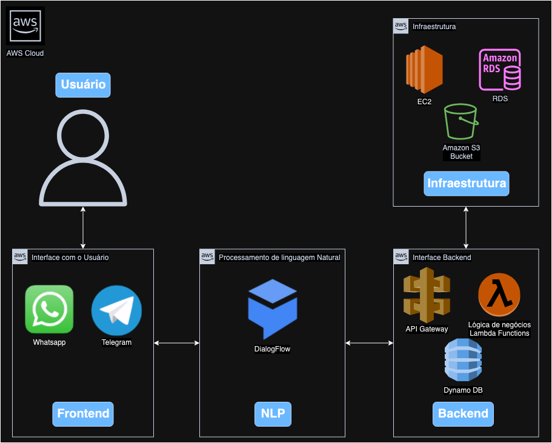

# FIAP - Faculdade de Informática e Administração Paulista

 

# Chatbot da Dra. Jô

## Nome do grupo

## 👨‍🎓 Integrantes: 
- <a href="https://www.linkedin.com/company/">Edmar Ferreira Souza</a>
- <a href="https://www.linkedin.com/company/">Thiago Lima Bernardes</a>
- <a href="https://www.linkedin.com/company/">Alexandre Oliveira Mantovani</a> 
- <a href="https://www.linkedin.com/company/">Ricardo Lourenço Coube</a> 

## 👩‍🏫 Professores:
### Tutor(a) 
- <a href="https://www.linkedin.com/in/lucas-gomes-moreira-15a8452a/">Lucas Gomes Moreira</a>
### Coordenador(a)
- <a href="https://www.linkedin.com/in/profandregodoi/">André Godoi</a>

## 📜 Descrição

Este documento descreve a proposta de arquitetura para o chatbot da Dra. Jô, desenvolvido para melhorar o atendimento ao cliente, automatizar respostas e fornecer informações úteis de forma eficiente.

### 1. Interface de Usuário (Front-end)
- **Canais de Comunicação**: O chatbot estará disponível em plataformas como WhatsApp, Telegram e no site da empresa (via widget de chat). Essas interfaces permitirão que os usuários interajam de forma prática e acessível.

### 2. Motor de Processamento de Linguagem Natural (NLP)
- **Google Dialogflow**: Utilizado como o motor de NLP, responsável por entender e processar a linguagem natural dos usuários. O Dialogflow interpretará as intenções das mensagens e as enviará ao backend para processamento.

### 3. Camada de Back-end
- **Amazon API Gateway**: Gerencia as solicitações RESTful recebidas do Dialogflow, expondo uma API para conectar o chatbot aos serviços internos.
- **AWS Lambda Functions**: Executa a lógica de negócios em resposta às solicitações do API Gateway, incluindo operações como busca de informações e processamento de dados.
- **DynamoDB**: Banco de dados NoSQL usado para armazenar o histórico de interações e dados dos usuários, garantindo consultas rápidas e escaláveis.

### 4. Infraestrutura
- **EC2 Instances**: Hospeda lógica de negócios adicional ou serviços personalizados que possam ser necessários.
- **RDS**: Banco de dados relacional para armazenar dados sensíveis dos usuários, conectado de forma segura às instâncias EC2.
- **S3**: Armazena arquivos estáticos, como PDFs e imagens que podem ser compartilhados pelo chatbot.

### 5. Segurança e Fluxo de Dados
- **Segurança**: A API Gateway será configurada com autenticação e autorização para proteção de dados e conformidade com a LGPD.
- **Fluxo de Dados**: As mensagens dos usuários são recebidas nos canais de comunicação e enviadas ao Google Dialogflow para interpretação. O Dialogflow encaminha as solicitações ao API Gateway, que aciona as Lambda Functions para executar a lógica de negócios e consultar dados no DynamoDB, RDS ou S3, conforme necessário.

## Descrição dos Elementos

- **Google Dialogflow**: Motor de NLP para interpretar as intenções dos usuários e encaminhar as respostas.
- **Amazon API Gateway**: Gerencia as chamadas de API e conecta o Dialogflow aos serviços de backend.
- **Lambda Functions**: Executa a lógica de negócios, processando dados e gerando respostas personalizadas.
- **DynamoDB**: Banco de dados NoSQL para armazenamento do histórico de interações e dados dos usuários.
- **EC2 Instances**: Hospeda serviços adicionais para lógica de negócios personalizada.
- **RDS**: Banco de dados relacional para armazenamento seguro de dados sensíveis.
- **S3**: Armazena conteúdo estático (documentos, imagens) acessível pelo chatbot.

## Previsão de Custos Mensal

- **Google Dialogflow**: Versão gratuita limitada; versão paga a partir de $0.002 por interação.
- **API Gateway**: Aproximadamente $3.50/milhão de solicitações.
- **Lambda Functions**: $0.20/milhão de solicitações, baseado em execução e tempo de processamento.
- **DynamoDB**: Aproximadamente $1.25 por unidade de leitura/escrita por hora.
- **EC2 e RDS**: Instâncias pequenas podem custar de $10 a $25/mês cada.
- **S3**: Custo inferior a $1/mês para armazenamento de baixo volume.

## Resultados Esperados

Espera-se que o chatbot da Dra. Jô:

- Melhore a experiência do cliente com respostas rápidas e automatizadas.
- Reduza a necessidade de suporte humano para questões comuns e consultas de rotina.
- Reduza o tempo de resposta e aumente a satisfação do cliente.
- Melhore a eficiência das operações de atendimento ao cliente.
- Aumente a escalabilidade da solução, permitindo crescimento futuro.
- Mantenha a conformidade com a LGPD para proteção de dados sensíveis.

Essa arquitetura utiliza o **Google Dialogflow** como motor de NLP, integrado com serviços da AWS para escalabilidade e segurança.

## 🗃 Histórico de lançamentos

* 1.0.0 - 10/11/2024

## 📋 Licença

<a property="dct:title" rel="cc:attributionURL" href="https://github.com/agodoi/template">MODELO GIT FIAP</a> por <a rel="cc:attributionURL dct:creator" property="cc:attributionName" href="https://fiap.com.br">Fiap</a> está licenciado sobre <a href="http://creativecommons.org/licenses/by/4.0/?ref=chooser-v1" target="_blank" rel="license noopener noreferrer" style="display:inline-block;">Attribution 4.0 International</a>.

